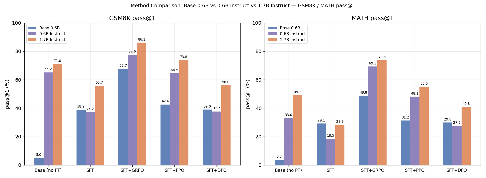

# LLM RL Reasoning

**A reproduction study on improving mathematical reasoning in small LLMs via SFT and RL with verifiable rewards (RLVR), following the DeepSeek-R1 recipe.**

Base model: Qwen3-0.6B/1.7B-Base &nbsp;|&nbsp; Tasks: GSM8K, MATH &nbsp;|&nbsp; Framework: [veRL](https://github.com/volcengine/verl) + vLLM

---

## Overview

DeepSeek-R1's report makes a striking claim: a base model with no reasoning training can acquire structured, self-correcting reasoning behavior through RL alone, given a verifiable reward. That's easy to accept on paper and hard to have real intuition for without running it yourself. This project reproduces the recipe end-to-end on a small model — cold-start SFT, then a controlled comparison of GRPO / PPO / DPO — and documents what actually happens along the way, including a full PPO training collapse and the fix.

Math reasoning (GSM8K/MATH) was chosen deliberately: the final answer is auto-gradable, but the reasoning path is not unique, which makes it one of the few tasks where RL can plausibly add value on top of SFT (as opposed to classification-style tasks where the SFT and RL signal are effectively the same information).

```
Qwen3-Base ──SFT (cold start)──► unified <think>/<answer> format
                                          │
                          ┌───────────────┼───────────────┐
                          ▼               ▼               ▼
                        GRPO             PPO             DPO
                 (group-relative,   (actor+critic+   (offline preference
                  no critic)         ref, on-policy)   pairs, off-policy)
                          │               │               │
                          └───────►  pass@k eval  ◄───────┘
                                 (GSM8K / MATH, same rule reward)
```

Reward is purely rule-based (regex-extract `<answer>`, normalize, compare to ground truth) — no reward model is trained. Implementation: [reward/rule_reward.py](reward/rule_reward.py).

## Results

| Method | GSM8K pass@1 | MATH pass@1 | Cost |
| --- | ---: | ---: | --- |
| Base (no post-training) | 4.8 | 3.7 | - |
| SFT only | 38.9 | 29.0 | low |
| SFT + DPO | 39.0 | 29.8 | low |
| SFT + PPO | 42.6 | 31.2 | high |
| **SFT + GRPO** | **67.7** | **48.8** | mid |

*Eval protocol: 500 held-out samples per dataset, temperature=0.8/top_p=0.95, 8 samples/question. Same rule-reward scorer used in training and eval. Full breakdown incl. all ablations: [docs/experiments.md](docs/experiments.md).*



## Key Findings

- **GRPO clearly outperforms PPO and DPO** under matched initialization and reward — and trains far more stably. Its group-relative advantage estimation removes the need for a critic entirely, which turns out to be the single biggest source of PPO's instability (see below).
- **PPO collapsed on the first attempt** (response length exploded to the max token limit, reward went negative) and was fixed via critic warmup + a stronger truncation penalty + tighter KL. Full postmortem: [docs/ppo_analysis.md](docs/ppo_analysis.md) — the most detailed write-up in this repo.
- **PPO's stability w.r.t. the KL coefficient is non-monotonic**: 0.005 and 0.02 both trained cleanly, but 0.01 — the value in between — collapsed reproducibly across two independent runs. Stability here isn't simply "more KL = safer."
- **Model scale beats longer SFT training**: swapping the 0.6B base for 1.7B (identical data/epochs) gained +18.8pp GSM8K pass@1 — several times the gain from tuning SFT epochs (3/7/15).
- **DPO barely moves the needle** (39.0 vs 38.9 SFT-only) because its preference pairs are self-sampled from the same SFT model — if it gets a question wrong 8/8 times, "chosen" is just the least-wrong wrong answer. Off-policy methods can't exceed the base policy's own ceiling this way.

## Repository Structure

```
├── data/scripts/       data prep: GSM8K/MATH download, CoT formatting, DPO pair construction
├── reward/             rule_reward.py — verifiable reward (answer match + format check)
├── training/           run_sft.sh / run_grpo.sh / run_ppo.sh / run_dpo.py, ablation/ scripts
├── eval/                pass@k evaluation, result plotting
├── patches/            infra-only patch on top of official veRL v0.4.0 (no algorithm changes)
└── docs/
    ├── experiments.md      full experiment log — every run, config, and number
    ├── sft_analysis.md     cold-start SFT: format, epoch ablation, scale comparison
    ├── grpo_analysis.md    GRPO config, group-size ablation
    └── ppo_analysis.md     the collapse → fix → KL ablation story
```

## Quick Start

```bash
pip install -r requirements.txt
pip install verl==0.4.0
git apply patches/verl-v0.4.0.patch   # infra-only patch, see docs/experiments.md

# 1. data
python data/scripts/prepare_gsm8k.py && python data/scripts/prepare_math.py
python data/scripts/build_sft_mix.py

# 2. cold-start SFT -> GRPO / PPO / DPO
bash training/run_sft.sh 4
bash training/run_grpo.sh 4          # recommended: most stable, best results
bash training/run_ppo.sh 4
accelerate launch training/run_dpo.py

# 3. eval
python eval/eval_pass_at_k.py --model <ckpt_path>
python eval/plot_results.py
```

Ablations are driven by env vars, e.g. `ROLLOUT_N=16 bash training/run_grpo.sh 2` or `KL_LOSS_COEF=0.005 bash training/run_ppo.sh 2` — see `training/ablation/` for the full set.

## Open Question

`strict_format_rate` (exact `<think>...</think><answer>...</answer>` closure) stays near 0 across every stage despite `has_answer_rate` >94%. A suspected off-by-one in the SFT loss mask was tried and reverted after it showed no effect — root cause is still open, most likely in the eval regex or chat template rather than the model. Documented as-is in [docs/sft_analysis.md](docs/sft_analysis.md).

## Acknowledgements

[veRL](https://github.com/volcengine/verl) · [vLLM](https://github.com/vllm-project/vllm) · [trl](https://github.com/huggingface/trl) · [DeepSeek-R1](https://arxiv.org/abs/2501.12948) · [Qwen3](https://huggingface.co/Qwen)

## License

[MIT](LICENSE)
