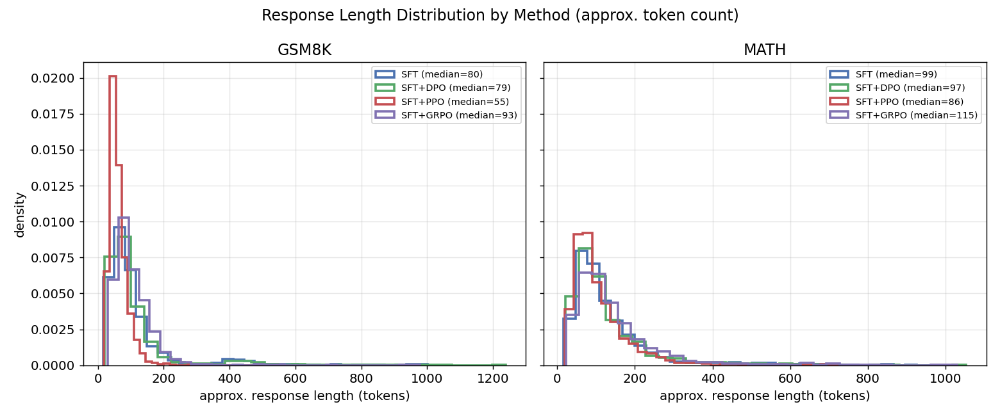
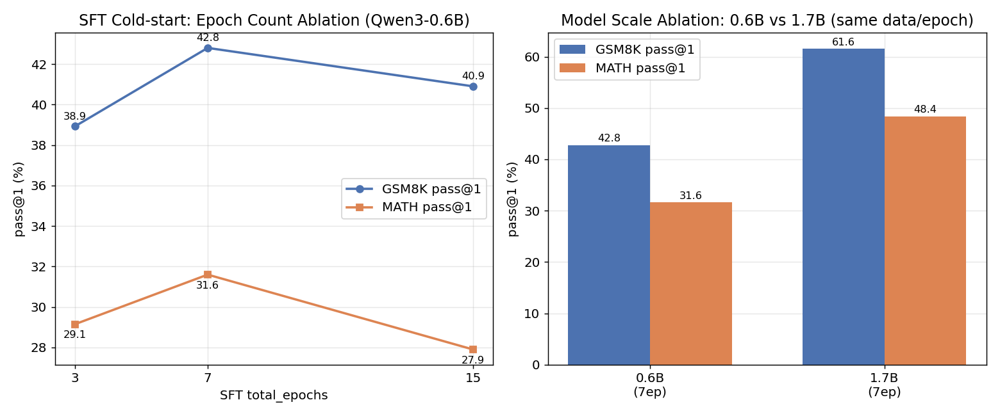
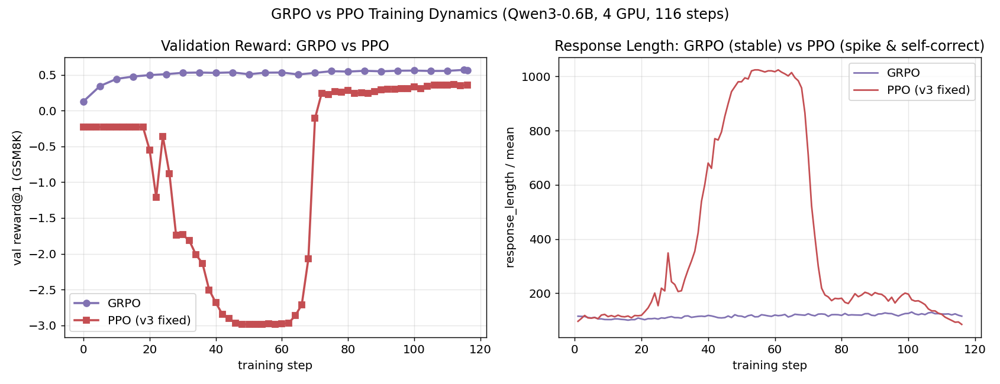
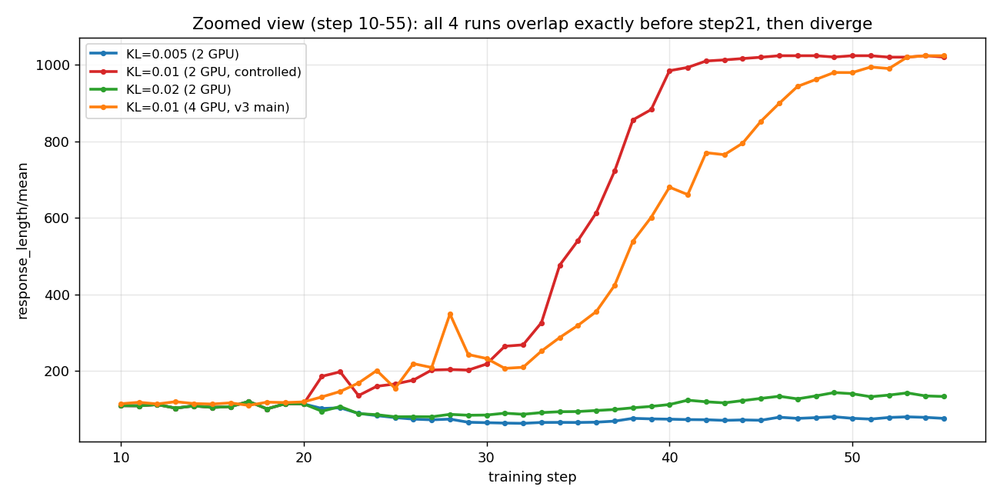
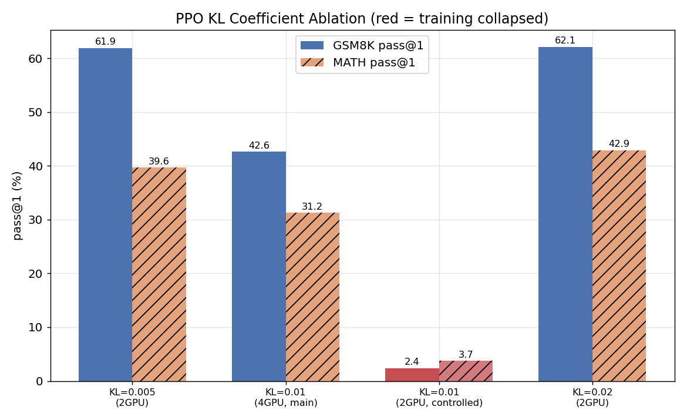
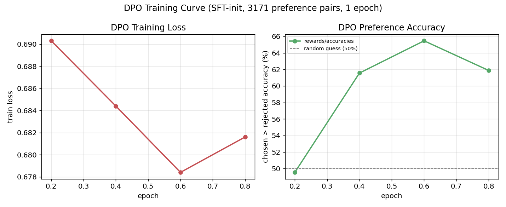

# Experiment Log

完整的实验配置、结果数据与逐条分析都记在这里，是 [README](../README.md) 里那张结果表格背后的全部细节。三个方法各自的专题复盘（原理、踩过的坑、消融实验）拆到了单独的文档里，读法建议：

- 先看 README 的 Results 和 Key Findings 有个整体印象
- 想深入某个方法的具体分析和踩坑过程，看 [sft_analysis.md](sft_analysis.md) / [grpo_analysis.md](grpo_analysis.md) / [ppo_analysis.md](ppo_analysis.md) / [dpo_analysis.md](dpo_analysis.md)
- 想看完整的原始实验数据、每一版消融的详细配置，就在本文档里按实验编号查

评估口径统一说明：所有阶段均使用 `eval/eval_pass_at_k.py` + `reward/rule_reward.py` 的同一套打分逻辑（训练/评估同源），保证跨阶段结果可比。

## 框架说明

训练主体是直接使用官方 [veRL](https://github.com/volcengine/verl) v0.4.0：SFT 用它的 `fsdp_sft_trainer`，GRPO/PPO 用它的 `main_ppo`（`algorithm.adv_estimator` 分别设为 `grpo`/`gae`）。DPO 单独用 `trl.DPOTrainer`（不在 veRL 内）。本仓库不携带 veRL 源码，按 README 说明 `pip install verl==0.4.0` 后，用 `git apply patches/verl-v0.4.0.patch` 打上以下基础设施补丁即可，没有任何算法逻辑改动：

| 文件 | 改动内容 |
| --- | --- |
| `verl/trainer/config/{ppo,sft}_trainer.yaml` | 新增 `trainer.wandb_proxy` 配置项（wandb 需走代理连外网，且不能污染影响 vLLM 等其他 HTTP 请求的全局 `http_proxy`） |
| `verl/trainer/fsdp_sft_trainer.py` | `Tracking(...)` 初始化时传入完整 config，让 wandb 记录训练超参 |
| `verl/utils/tracking.py` | `wandb_proxy` 取值方式改为链式 `.get()`，避免 `config=None` 时报错 |
| `verl/workers/reward_manager/naive.py` | 用 `inspect.signature` 检测自定义 `compute_score` 是否支持 `response_length_ratio` 参数，支持则传入——这是 [PPO 崩溃修复](ppo_analysis.md)里截断惩罚能生效的关键一环 |

---

## 方法对比总表（汇总视图，实时更新）

| 方法 | 基座模型 | GSM8K pass@1 | GSM8K pass@8 | MATH pass@1 | MATH pass@8 | 训练成本 | 备注 |
| --- | --- | --- | --- | --- | --- | --- | --- |
| Base（无post-training） | Qwen3-0.6B-Base | 4.8% | 30.6% | 3.7% | 24.8% | - | 见下方实验①，pass@8远高于pass@1，说明模型有潜力但格式/稳定性不足 |
| SFT only | Qwen3-0.6B-Base | 38.9% | 78.4% | 29.0% | 66.4% | 低 | 见实验②，2000+2000条冷启动数据，3个epoch |
| SFT only（消融，15 epoch） | Qwen3-0.6B-Base | 40.9% | 73.8% | 27.9% | 64.2% | 低 | 见实验②消融，同数据/格式仅加长epoch，MATH反而略降，未接入下游RL |
| SFT only（消融，7 epoch） | Qwen3-0.6B-Base | 42.8% | 79.2% | 31.6% | 69.6% | 低 | 见实验②消融，同系列中0.6B pass@1最优的SFT版本，但未接入下游RL |
| SFT only（1.7B规模对比，7 epoch） | Qwen3-1.7B-Base | **61.6%** | 89.0% | **48.4%** | 85.4% | 低 | 见实验②'，同数据/格式/epoch数，仅基座从0.6B换成1.7B，效果全面碾压所有0.6B版本，未接入下游RL |
| SFT+DPO | Qwen3-0.6B-Base | 39.0% | 78.0% | 29.8% | 69.0% | 低 | 见实验⑤，相比SFT only基本持平，提升有限 |
| SFT+PPO | Qwen3-0.6B-Base | 42.6% | 76.8% | 31.2% | 69.0% | 高 | 见实验④，v1崩溃→v3修复（KL=0.01）后4卡上自愈成功，但2卡受控实验证明KL=0.01本身不稳定（见P1消融），建议改用KL=0.005/0.02 |
| SFT+GRPO | Qwen3-0.6B-Base | 67.7% | 85.0% | 48.8% | 79.2% | 中 | 见实验③，本轮实验中效果最好、训练最稳定的方法 |
| SFT+GRPO（消融，n=4） | Qwen3-0.6B-Base | 68.0% | 86.2% | 47.9% | 79.8% | 中低（2卡） | 见实验③ P1消融，group size减半效果持平甚至略优 |
| SFT+GRPO（消融，n=16） | Qwen3-0.6B-Base | 69.0% | 84.3% | 32.1% | 59.0% | 中低（2卡） | 见实验③ P1消融，GSM8K略优于n=8，MATH明显下降 |
| SFT+PPO（消融，KL=0.005） | Qwen3-0.6B-Base | 61.9% | 86.0% | 39.7% | 75.6% | 高（2卡） | 见实验④ P1消融，全程无length上冲，明显优于v3对照组 |
| SFT+PPO（消融，KL=0.01，2卡受控） | Qwen3-0.6B-Base | 2.4% | 13.3% | 3.7% | 17.4% | 高（2卡） | 见实验④ P1消融，**彻底崩溃**，证明KL=0.01在当前配置下本身不稳定（非4卡偶然现象） |
| SFT+PPO（消融，KL=0.02） | Qwen3-0.6B-Base | 62.1% | 88.2% | 42.9% | 78.0% | 高（2卡） | 见实验④ P1消融，全程无length上冲，明显优于v3对照组 |

**可视化：方法对比总览**（数据来源：`eval/plot_results.py`，运行一次即可从 `eval/results/*.json` 重新生成，无需重新推理评估）：

从这两张图可以更直观地看到两条核心结论：(1) 柱状图上 GRPO（紫色）在两条基准线上都远高于其余方法，是本轮效果最好的方案；(2) 折线图上 Base 模型（灰色）在 k=1→8 上有最陡的爬升斜率，印证了"模型有潜力但格式/稳定性不足"的判断，而 SFT 之后的各方法整体上移且 k=1 与 k=8 之间的差距明显收窄，说明 post-training 把"偶尔蒙对"转化为了"更稳定地做对"。

**响应长度分布对比**（对应 `01_motivation_and_design.md` 7.5 节"推理长度涌现"关注点，从各方法评估结果的逐样本生成文本估算 token 长度，脚本：`eval/plot_results.py`）：

GSM8K 上 SFT+PPO（红色）的长度分布明显左移、中位数最短（55 tokens，其余方法在 79-93 之间），这与实验④中"v3 修复方案引入截断惩罚+更保守的KL/温度"导致模型倾向于生成更短、更收敛的回答相互印证；而 SFT+GRPO（紫色）的中位数在两个数据集上都是四者中最长（GSM8K 93、MATH 115），且在 MATH 上的分布相比 GSM8K 明显右移，说明 GRPO 训练后模型在更难的任务上会自发生成更长的推理过程，这正是 `01_motivation_and_design.md` 里提到的"推理长度涌现"现象的一个初步佐证，但由于本项目的 reward 未显式奖励长度，这里的变化更可能是"任务难度驱动"而非"R1式的自主思考延长"，如需严格验证还需要观察同一方法训练过程中的长度演变趋势（见上文各消融小节的 response_length 训练曲线）。

---

## 实验① Base 模型 Baseline（Qwen3-0.6B-Base，无 post-training）

**日期**：2026-08-06

**目的**：作为整套 post-training 流程（SFT/DPO/PPO/GRPO）效果对比的参照系，验证"多阶段优化是否真的带来提升"必须先有这条基准线。

**配置**：
- 模型：`Qwen3-0.6B-Base`（未经任何微调）
- 评估脚本：`train/eval/eval_pass_at_k.py`
- 数据集：GSM8K 测试集抽样 500 条 / MATH 测试集抽样 500 条（各自数据集的前500条子集）
- 采样参数：`temperature=0.8, top_p=0.95, max_new_tokens=1024, k_list=1,4,8`（每题采样8次，seed=42）
- 打分逻辑：`RuleReward`（规则reward，答案规范化匹配 + 格式校验），与训练阶段reward函数同源

**结果**：

| 数据集 | pass@1 | pass@4 | pass@8 |
| --- | --- | --- | --- |
| GSM8K | 4.8% | 17.4% | 30.6% |
| MATH | 3.7% | 13.8% | 24.8% |

原始数据：`train/eval/results/baseline_qwen3_0.6b_base.json`（含逐样本明细）

**分析**：
- `pass@8` 相比 `pass@1` 有 6-7 倍的提升幅度（GSM8K: 4.8%→30.6%，MATH: 3.7%→24.8%），说明 Base 模型本身已经具备一定概率生成正确推理路径的能力，问题不在于"完全不会做题"
- greedy解码（约等于pass@1场景）下表现差，推测主因是：(1) 没有稳定的 `<think>/<answer>` 输出格式，容易跑偏或复读题目原文；(2) 输出方差大，正确答案零散分布在多次采样中而非稳定复现
- **这为SFT冷启动设定了明确的验收目标**：SFT后的 pass@1 应该显著向当前 pass@8 的水平靠拢（即把"偶尔蒙对"变成"稳定做对"），而不是期望SFT大幅提升pass@8上限（那是RL阶段的任务）

---

## 实验② SFT 冷启动

**日期**：2026-08-06

**目的**：把 Base 模型在推理任务上"偶尔能蒙对"的能力，转化为稳定的 `<think>/<answer>` 格式输出和明显更高的 pass@1，为后续 RL/DPO 阶段提供统一的策略初始化权重（`models/sft_coldstart/qwen3-0.6b/global_step_42`）。

**配置**：
- 模型：`Qwen3-0.6B-Base`
- 训练脚本：`train/training/run_sft.sh`（基于 veRL `fsdp_sft_trainer`）
- 数据：`gsm8k_sft_coldstart` + `math_sft_coldstart` 混合数据（各约2000条），`max_length=1536`
- 超参：`optim.lr=1e-5`，`micro_batch_size_per_gpu=4`，`total_epochs=3`（42 steps）
- 评估脚本：`train/eval/eval_pass_at_k.py`，数据集/采样参数与实验①一致（GSM8K/MATH各500条，`k_list=1,4,8`，8次采样/题）

**结果**：

| 数据集 | pass@1 | pass@4 | pass@8 | strict_format_rate | has_answer_rate |
| --- | --- | --- | --- | --- | --- |
| GSM8K | 38.9% | 66.8% | 78.4% | 0.0% | 94.4% |
| MATH | 29.0% | 55.8% | 66.4% | 0.0% | 97.3% |

原始数据：`train/eval/results/sft_coldstart_qwen3_0.6b.json`

**分析**：
- 相比 Base 模型，pass@1 有数量级提升（GSM8K: 4.8%→38.9%，MATH: 3.7%→29.0%），验证了 SFT 冷启动"把偶尔蒙对变成稳定做对"的设计目标基本达成
- `has_answer_rate` 达到 94-97%，说明模型已经能稳定地在输出中给出可提取的答案，但 `strict_format_rate` 为 0——即输出没有严格满足评估脚本要求的 `<think>...</think><answer>...</answer>` 精确标签闭合格式（可能存在多余文本、标签不闭合或轻微变体）。这个格式合规率口径在 GRPO/PPO/DPO 各阶段的评估中也都是 0，说明是贯穿全流程的统一现象，而非 SFT 阶段独有的问题，不影响跨阶段横向对比，但后续如需对外展示"格式合规率"指标，建议排查 `rule_reward.py` 中的正则匹配规则是否过于严格

### 消融实验：SFT 训练 epoch 数（3 / 7 / 15）

**目的**：验证 SFT 冷启动阶段训练更久（更多 epoch）是否能带来更好的下游 pass@1，同时排查是否存在过拟合。

**配置**：与主实验完全同数据（`sft_coldstart_mix_train/val.parquet`）、同格式（`<think>/<answer>`）、同超参（`lr=1e-5`，`max_length=1536`），仅 `total_epochs` 不同，均为 4×GPU 训练。

| epoch 数 | 总 steps | checkpoint 路径 | GSM8K pass@1 | GSM8K pass@8 | MATH pass@1 | MATH pass@8 | strict_format_rate | has_answer_rate |
| --- | --- | --- | --- | --- | --- | --- | --- | --- |
| 3（主实验，下游RL基座） | 42 | `models/sft_coldstart/qwen3-0.6b/global_step_42` | 38.9% | 78.4% | 29.0% | 66.4% | 0.0% | 94.4% |
| 7 | 98 | `models/sft_coldstart/qwen3-0.6b_v3/global_step_98` | **42.8%** | 79.2% | **31.6%** | 69.6% | 0.0% | 97.9%/98.9% |
| 15 | 210 | `models/sft_coldstart/qwen3-0.6b_v2/global_step_210` | 40.9% | 73.8% | 27.9% | 64.2% | 1.45% | 99.4%/99.9% |

原始数据：`train/eval/results/sft_coldstart_qwen3_0.6b_v3.json`（未落盘为独立文件时见 `logs/eval_sft_v3.log`）、`logs/eval_sft_v2.log`

**分析**：
- 7 epoch 相比 3 epoch，GSM8K/MATH pass@1 都有进一步提升（38.9%→42.8%，29.0%→31.6%），说明主实验用的 3 epoch 并未训练充分，仍有提升空间
- 但继续加长到 15 epoch 后，GSM8K pass@1 略降（42.8%→40.9%），**MATH pass@1 明显低于 7 epoch 版本（31.6%→27.9%），且低于 3 epoch 主实验（29.0%）**，说明训练时长和效果并非单调关系，15 epoch 可能已经出现轻微过拟合（对训练数据分布过度拟合，牺牲了对 MATH 这种难度更高、分布更发散任务的泛化）
- `strict_format_rate` 随 epoch 数增加有小幅回升（0%→0%→1.45%），但整体仍然极低，说明格式合规率低不是简单靠"训练更久"能解决的，根因仍需按实验②分析里提到的方向排查
- **重要说明**：7 epoch（v3）和 15 epoch（v2）这两个更强的 SFT checkpoint 目前**均未被接入下游 GRPO/PPO/DPO 训练**，所有下游 RL 实验仍然基于 3 epoch 的原始版本初始化。如果要进一步压榨下游 RL 的效果上限，一个值得尝试的方向是换成 7 epoch 版本作为初始化权重重跑 GRPO/PPO

### 消融实验：模型规模对比（Qwen3-0.6B vs Qwen3-1.7B）

**目的**：在完全相同的数据、格式、超参、epoch 数下，验证基座模型规模本身对 SFT 冷启动效果的影响。

**配置**：与 7 epoch（v3）版本除基座模型外完全一致（同数据 `sft_coldstart_mix_train/val.parquet`、同格式、`lr=1e-5`、`max_length=1536`、`total_epochs=7`，98 steps，4×GPU），仅 `model.partial_pretrain` 从 `Qwen3-0.6B-Base` 换成 `Qwen3-1.7B-Base`。

| 基座模型 | checkpoint 路径 | GSM8K pass@1 | GSM8K pass@4 | GSM8K pass@8 | MATH pass@1 | MATH pass@4 | MATH pass@8 | strict_format_rate | has_answer_rate |
| --- | --- | --- | --- | --- | --- | --- | --- | --- | --- |
| Qwen3-0.6B-Base | `models/sft_coldstart/qwen3-0.6b_v3/global_step_98` | 42.8% | - | 79.2% | 31.6% | - | 69.6% | 0.0% | 97.9%/98.9% |
| **Qwen3-1.7B-Base** | `models/sft_coldstart/qwen3-1.7b_v3/global_step_98` | **61.6%** | 83.2% | **89.0%** | **48.4%** | 75.9% | **85.4%** | 0.0% | 99.8%/99.3% |

原始数据：`train/eval/results/sft_coldstart_qwen3_1.7b_v3.json`；训练日志：`logs/sft_qwen3_1.7b_v3.log`；评估日志：`logs/eval_sft_1.7b_v3.log`

**分析**：
- **模型规模带来的收益远大于 epoch 数消融（3→7→15）带来的收益**：0.6B 系列在 epoch 数上反复调整，pass@1 最多也只在 38.9%~42.8% 之间波动（GSM8K）、27.9%~31.6%之间波动（MATH）；而仅把基座从 0.6B 换成 1.7B（其余配置完全不变），GSM8K pass@1 直接跳到 61.6%（+18.8pp 相对最优 0.6B 版本），MATH pass@1 跳到 48.4%（+16.8pp），提升幅度是 epoch 数消融的数倍
- `pass@8`（89.0%/85.4%）也全面超过 0.6B 各版本，说明 1.7B 不仅"更容易蒙对"，其推理能力上限本身就更高，不是单纯靠采样次数堆出来的
- `has_answer_rate` 也小幅提升到 99%+（0.6B 为 94-99%），说明更大模型在遵循输出格式指令上也更稳定，但 `strict_format_rate` 依然是 0%，说明"精确的 `<think>...</think><answer>...</answer>` 闭合格式合规率低"是跨模型规模的普遍现象，进一步印证这个问题更可能出在评估脚本的正则匹配规则或 chat template 上，而非模型能力不足
- **重要说明**：1.7B 版本目前**仅完成了 SFT 阶段的训练和评估，尚未接入下游 GRPO/PPO/DPO**。考虑到 SFT 阶段就已展现出的巨大规模优势，如果算力允许，后续在 1.7B 上复现 GRPO/PPO 全链路、并与当前 0.6B 主线结果做对比，会是一个非常值得投入的方向

**epoch数消融 + 模型规模对比可视化**（脚本：`eval/plot_results.py`）：

左图折线图直观呈现了"7 epoch 是甜点、15 epoch 出现过拟合拐点"的非单调关系——GSM8K/MATH pass@1 都在 7 epoch 处达到峰值，15 epoch 时同时回落；右图柱状图上 1.7B（同数据/格式/epoch）相比 0.6B 的提升幅度远超 epoch 数消融本身带来的差异，两根柱子的高度差一眼就能看出模型规模才是当前最大的效果杠杆。

---

## 实验③ GRPO

**日期**：2026-08-06 ~ 2026-08-07

**目的**：以 SFT 冷启动模型为初始化权重，用 GRPO（组内相对优势，无需 critic）做 on-policy RL 训练，验证其相比 SFT 的效果提升，并作为与 PPO 的对照组。

**配置**：
- 初始化模型：`models/sft_coldstart/qwen3-0.6b/global_step_42`
- 训练脚本：`train/training/run_grpo.sh`（veRL `main_ppo` + `algorithm.adv_estimator=grpo`），4×GPU FSDP + vLLM rollout
- 关键超参：`train_batch_size=256`，`ppo_mini_batch_size=64`，`rollout.n=8`（GRPO group size），`actor_lr=1e-6`，`kl_loss_coef=0.001`（`low_var_kl`），`entropy_coeff=0`，`max_prompt_length=512`，`max_response_length=1024`，`total_epochs=4`
- reward：`reward/rule_reward.py` 规则打分（答案正确性 + 格式）
- 数据：`data/processed/gsm8k/train.parquet`（训练），验证用同源 GSM8K test 集
- 评估：训练结束后用 `eval/eval_pass_at_k.py` 在 GSM8K/MATH 各500条测试集上评估（与实验①②同口径）

**结果**：

| 数据集 | pass@1 | pass@4 | pass@8 | strict_format_rate | has_answer_rate |
| --- | --- | --- | --- | --- | --- |
| GSM8K | 67.7% | 80.4% | 85.0% | 0.0% | 99.8% |
| MATH | 48.8% | 71.5% | 79.2% | 0.0% | 98.2% |

原始数据：`train/eval/results/grpo_qwen3_0.6b.json`；训练日志：`logs/pipeline/stage2_train_grpo.log`

**训练过程可视化**（与下方实验④ PPO 的同期训练曲线并排对比，脚本：`training/plot_training_curves.py`）：

左图 validation reward 曲线上 GRPO（紫色）平滑单调上升且明显早于 PPO 到达更高水平；右图 response_length 曲线上 GRPO 全程稳定在 100-130 区间的窄幅波动，与 PPO（红色）在 step 20-70 之间的大幅拔高又回落形成鲜明对比，具体崩溃/自愈过程见下方实验④ PPO 小节。

**训练过程关键指标**（116 steps，4 epochs）：

| step | val reward@1 (GSM8K) | response_length/mean | actor/entropy_loss |
| --- | --- | --- | --- |
| 0（初始） | 0.129 | - | - |
| 5 | 0.344 | 108.9 | 0.750 |
| 30 | 0.529 | 110.1 | 0.413 |
| 60 | 0.533 | 119.6 | 0.325 |
| 90 | 0.550 | 117.5 | 0.291 |
| 116（最终） | 0.563 | 115.6 | 0.289 |

**分析**：
- 训练全程稳定收敛：验证集 reward 从初始 0.129 单调爬升到 0.563，`response_length` 始终稳定在 100-125 区间，没有出现长度失控或 reward 塌陷
- 相比 SFT only，pass@1 提升幅度最大（GSM8K: 38.9%→67.7%，+28.8pp；MATH: 29.0%→48.8%，+19.8pp），是本轮全部方法中效果最好、训练最稳定的一个
- 推测稳定性的关键原因：GRPO 采用组内（`rollout.n=8`）相对排名计算 advantage，不需要额外训练一个 critic 网络，天然对"某条 rollout 异常拉长导致 reward 计算偏差"更鲁棒；而下面 PPO 实验的崩溃恰好反证了这一点（同样的 KL 系数和学习率，PPO 因为依赖一个从零学习价值函数的 critic 而在训练早期就崩溃）
- 训练成本：4张卡、4个epoch、116 steps，约2小时（22:17:53~00:21:24），介于 DPO（低）和 PPO（高，含 critic 前向反向）之间，标记为"中"

### P1 消融实验：GRPO group size（rollout.n）

**目的**：验证组内采样数（group size，即每个 prompt 采样多少次用于计算组内相对 advantage）对 GRPO 训练效果的影响。

**配置**：其余超参与主实验完全一致（`train_batch_size=256`，`ppo_mini_batch_size=64`，`kl_loss_coef=0.001`，`actor_lr=1e-6`，`total_epochs=4`），仅 `rollout.n`（group size）不同，2卡训练。脚本：`training/_ablation_grpo_n4.sh` / `_ablation_grpo_n16.sh`。

| group size (n) | GPU | GSM8K pass@1 | GSM8K pass@8 | MATH pass@1 | MATH pass@8 | val reward@1 (最终) | response_length/mean (最终) |
| --- | --- | --- | --- | --- | --- | --- | --- |
| 4 | 2卡 | **68.0%** | 86.2% | **47.9%** | 79.8% | 0.577 | 120.3 |
| 8（主实验，对照组） | 4卡 | 67.7% | 85.0% | 48.8% | 79.2% | 0.563 | 115.6 |
| 16 | 2卡（从step70恢复） | 69.0% | 84.3% | 32.1% | 59.0% | 0.596 | 126.9 |

原始数据：`train/eval/results/grpo_qwen3_0.6b_n4.json` / `grpo_qwen3_0.6b_n16.json`；训练日志：`logs/ablation/grpo_n4.log` / `grpo_n16_resume.log`

**消融结果柱状图**：

**训练过程曲线**（validation reward / response_length 随 step 变化，三组 n 叠加对比，脚本：`training/plot_training_curves.py`）：

三组的 validation reward 曲线在 step 60 之前几乎重合，之后 n=16、n=8 略高于 n=4；response_length 曲线同样高度重叠，只是 n=16 波动幅度略大，直观印证了下面分析中"group size 在训练任务本身(GSM8K)上边际影响较小"的结论——曲线层面看不出谁明显更优，真正的差异要看下方 MATH 泛化性数据。

**分析（n=4 vs n=8 vs n=16）**：
- **n=4 的效果与 n=8 几乎持平，甚至 GSM8K 上略优**（68.0% vs 67.7%），说明在 GSM8K 这种相对简单、reward 信号清晰的任务上，group size 从 8 降到 4 并没有明显损失组内相对排名的判别力——4 个样本已经足够估计出"哪个更好"的相对顺序
- **n=16 在 GSM8K 上进一步小幅提升到 69.0%（略高于n=8的67.7%和n=4的68.0%），但在 MATH 上却明显下降到 32.1%（远低于n=8的48.8%和n=4的47.9%）**，且 `val reward@1` 最高（0.596），说明 n=16 在训练用的 GSM8K 数据上过拟合/收敛得更充分，但没有等比例迁移到分布不同、难度更高的 MATH 任务上，出现了任务间泛化不一致的现象
- 这一结果具有实践价值：**更小的 group size 意味着更低的 rollout 开销**（每个 prompt 生成的样本数减半），在算力有限时，适当降低 group size 是一个性价比较高的选择，不需要为了"理论上更准确的组内基线"盲目堆大 n；而单纯增大 n（16）虽然在训练任务本身（GSM8K）上収益微弱，却可能以牺牲跨任务泛化（MATH）为代价，需要谨慎
- 需要注意 n=4/n=16 都只用了 2 张卡（vs 主实验 8卡），且 n=16 训练过程中曾发生一次意外中断（进程被杀，疑似OOM或会话终止），从 `global_step_70` 的 checkpoint 恢复后继续跑完剩余步数，训练轨迹并非一次连续无中断的过程，这也是需要如实说明的局限性
- 综合来看，**group size 在 4~16 这个范围内对 GSM8K 单任务效果的边际影响较小**，但 n=16 出现的 MATH 明显退化提示：如果目标是训练一个跨任务泛化能力强的模型，一味增大 group size 未必是稳妥的选择，需要结合多任务评估综合判断，不能只看训练任务本身的 reward 曲线

---

## 实验④ PPO

**日期**：2026-08-06 ~ 2026-08-07（v1/v2 崩溃 → v3 修复成功）

**目的**：以 SFT 冷启动模型为初始化权重，跑通完整 PPO（Actor+Critic+Reward+Reference 四模型协同），与 GRPO 做同条件对比。

### v1/v2 崩溃记录（失败样本，保留用于复盘）

**配置**：与 GRPO **完全对齐**——`train_batch_size=256`，`ppo_mini_batch_size=64`，`actor_lr=1e-6`，`kl_loss_coef=0.001`，`critic_lr=1e-5`，`gamma=1.0`，`lam=0.95`（GAE），`rollout.n=1`，`max_response_length=1024`，`total_epochs=4`，`critic_warmup=0`。

**崩溃过程**：PPO 在训练早期发生了"response length 爆炸 + reward 塌陷"——step 0→5 验证集 reward 从 0.129 骤降到 -0.934，step 5→20 `response_length` 从 183 拉满到 1024（`clip_ratio` 100%），之后模型陷入"输出恒定拉满长度"的退化解，最终 pass@k 评估结果为 0%。

**根因**：PPO 的 critic 从随机初始化的 value head 开始训练，训练初期价值估计误差极大（`vf_explained_var` 从 -2.273 起步），GAE 计算出的 advantage 信号不可靠。在没有组内基线校正（GRPO 天然有）的情况下，一旦某次更新让"变长输出"获得正 advantage，策略梯度就持续强化该方向，rule reward 对截断的 -1 固定惩罚不够陡峭，未能纠偏，最终不可逆地崩溃。

### v3 修复方案（成功）

**配置变更**（v1 → v3 的关键修复）：

| 参数 | v1（崩溃） | v3（修复） | 修复原理 |
| --- | --- | --- | --- |
| `critic_warmup` | 0 | **20** | 训练前20步只更新critic不更新actor，让价值函数先"学会预测"再开始策略优化 |
| `kl_loss_coef` | 0.001 | **0.01** | 10倍KL惩罚，限制策略偏离SFT初始分布的速度，防止早期exploration失控 |
| `critic_lr` | 1e-5 | **5e-6** | 降低critic学习率，抑制价值函数早期震荡 |
| `critic.cliprange_value` | 0.5（默认） | **0.2** | 收紧价值函数单步预测跳动幅度 |
| `rollout.temperature` | 1.0 | **0.7** | 降低采样温度，减少rollout方差 |
| `truncated_extra_penalty` | 0 | **2.0** | 对截断样本施加额外惩罚（通过`reward_kwargs`传入`rule_reward.py`），让"拉长输出"获得更强负反馈 |
| `length_penalty_start_ratio` | - | **0.9** | 响应长度超过上限90%即开始施加渐进惩罚 |

**关键代码改动**：
- `reward/rule_reward.py`：`compute_score` 新增 `response_length_ratio`、`truncated_extra_penalty`、`length_penalty_start_ratio` 参数，支持基于长度比的渐进惩罚
- `verl/workers/reward_manager/naive.py`：`NaiveRewardManager` 用 `inspect.signature` 动态检测 `compute_score` 是否接受 `response_length_ratio`，兼容旧签名
- `training/run_ppo.sh`：通过 hydra 的 `custom_reward_function.reward_kwargs` 将 `truncated_extra_penalty` 和 `length_penalty_start_ratio` 传递给 reward 函数

**结果**（v3 修复后）：

| 数据集 | pass@1 | pass@4 | pass@8 | strict_format_rate | has_answer_rate |
| --- | --- | --- | --- | --- | --- |
| GSM8K | 42.6% | 67.7% | 76.8% | 0.0% | 99.9% |
| MATH | 31.2% | 57.7% | 69.0% | 0.0% | 99.7% |

原始数据：`train/eval/results/ppo_qwen3_0.6b.json`；checkpoint：`models/ppo_ckpt/ppo_qwen3_0.6b/global_step_116/actor/huggingface`

**训练过程关键指标**（116 steps，4 epochs，v3）：

| step | val reward@1 (GSM8K) | response_length/mean | clip_ratio | vf_explained_var | score_mean |
| --- | --- | --- | --- | --- | --- |
| 0（初始） | 0.129 | - | - | - | - |
| 20（warmup结束） | ~0.35 | ~200 | ~5% | ~0.55 | ~0.40 |
| 28（length上冲峰值） | - | ~348 | ~8% | ~0.60 | ~0.35 |
| 60 | ~0.36 | ~150 | ~0% | ~0.70 | ~0.40 |
| 116（最终） | **0.358** | **85** | **0%** | **0.634** | **0.408** |

**崩溃(v1) vs 修复(v3) 可视化对比**（全项目最有故事性的一张图，脚本：`training/plot_training_curves.py`）：

左图清晰展示了 v1（红色）在 step 10 前后就直接冲顶 1024（`max_response_length`）且再未回落，而 v3（绿色）虽然在 step 40-65 之间也出现了明显的长度上冲峰值，但随后成功回落并稳定在 100 左右；右图 validation reward 对应地显示 v1 一路下探到 -3 附近再未恢复，v3 则在同样探底之后于 step 65-70 附近实现"触底反弹"，最终收敛到正值——两条曲线的对比比任何文字描述都更直观地呈现了"崩溃"和"自愈"的本质区别。

**v3 修复分析**：
1. **step 20（critic_warmup 结束）**：`vf_explained_var` 从训练初期的不稳定逐步提升到 ~0.55，说明 critic warmup 成功让价值函数建立了合理的初始预测能力，actor 开始参与训练时 advantage 信号已不像 v1 那样不可靠
2. **step 21-28（length 上冲）**：`response_length_mean` 上冲到 ~348，这是 critic warmup 结束后 actor 开始更新的正常 exploration 行为。v1 在此阶段直接失控到 1024，v3 的 `truncated_extra_penalty=2.0` + `kl_loss_coef=0.01` 形成负反馈，阻止了失控
3. **step 28→116（自我修正）**：`response_length_mean` 从 348 逐步回落到 85-122 区间并稳定，`clip_ratio` 降为 0%，`score_mean` 回升到 0.40——这是关键的"自我修正"信号，v1/v2 均未能实现这一步
4. **最终 val reward@1 = 0.358**，虽然低于 GRPO 的 0.563，但相比 v1 的 -0.101 是从完全崩溃到正常收敛的质变

**PPO vs GRPO 对比**：
- PPO pass@1（GSM8K 42.6%）略高于 SFT baseline（38.9%），但远低于 GRPO（67.7%）
- PPO 训练稳定性修复后虽未崩溃，但效果仍不及 GRPO，推测主因：(1) `rollout.n=1` 采样方差大、advantage 估计噪声高；(2) 0.6B 模型的 critic 容量有限，`vf_explained_var` 最终仅 0.63（GRPO 不需要 critic）；(3) 更保守的超参（KL=0.01, temp=0.7）虽然保证了稳定性但牺牲了 exploration
- 训练成本：4张卡、4个epoch、116 steps，含 critic 前向反向，总耗时约1.5小时（v3），标记为"高"

### P1 消融实验：PPO KL 惩罚系数（kl_loss_coef）

**目的**：在 v3 修复方案（critic_warmup=20 + truncated_extra_penalty=2.0 + critic.cliprange_value=0.2 等其余防线不变）的基础上，验证 KL 系数本身对训练稳定性和最终效果的边际影响。

**配置**：其余超参与 v3 主实验完全一致，仅 `kl_loss_coef` 不同，2卡训练（v3 主实验为4卡）。脚本：`training/_ablation_ppo_kl005.sh` / `_ablation_ppo_kl02.sh`。

| kl_loss_coef | GPU | GSM8K pass@1 | GSM8K pass@8 | MATH pass@1 | MATH pass@8 | val reward@1(最终) | vf_explained_var(最终) | response_length/mean(最终) | 是否出现length上冲 |
| --- | --- | --- | --- | --- | --- | --- | --- | --- | --- |
| 0.005 | 2卡 | **61.9%** | 86.0% | **39.7%** | 75.6% | 0.505 | 0.821 | 107 | 否，全程60-130平稳 |
| 0.01（4卡，v3主实验） | 4卡 | 42.6% | 76.8% | 31.2% | 69.0% | 0.358 | 0.634 | 85 | 是，step21-39冲高到1024（打满上限），step70左右回落，此后稳定 |
| **0.01（2卡，受控对照）** | 2卡 | **2.4%** | 13.3% | 3.7% | 17.4% | -1.258 | 0.513 | 976 | **是，且比4卡更严重：step21-46冲高到1024封顶，step80左右一度回落到400+，但step107再次复发冲回1024，训练结束都未能真正稳定** |
| 0.02 | 2卡 | **62.1%** | 88.2% | **42.9%** | 78.0% | 0.503 | 0.948 | 189 | 否，从100缓慢升至190，无失控 |

原始数据：`train/eval/results/ppo_qwen3_0.6b_kl0.005.json` / `ppo_qwen3_0.6b_kl0.02.json` / `ppo_qwen3_0.6b_kl0.01_2gpu.json`；训练日志：`logs/ablation/ppo_kl005.log` / `ppo_kl02.log` / `ppo_kl01_2gpu.log`

**训练曲线对比图**（response_length/mean、critic/vf_explained_var、response_length/clip_ratio 随 step 变化）：

**分岔区间放大图**（step 10-55，四组在 step21 之前完全重合，之后走向分化）：

**四组 pass@1 数值对比柱状图**（与上面的训练过程曲线互补，直接看最终效果差异，脚本：`eval/plot_results.py`）：

红色柱对应 KL=0.01（2卡受控组）的崩溃结果，pass@1 几乎跌到 0 附近，与其余三组 60%+ 的水平形成极端对比，一眼就能看出这个取值在当前配置下确实不稳定，而非偶然现象。

**⚠️ 关键发现（已通过受控实验验证）**：

1. **补做了 KL=0.01 的 2卡受控对照实验**（`training/_ablation_ppo_kl01_2gpu.sh`，其余超参与 KL=0.005/0.02 消融组完全一致，唯一变量是 KL 系数），结果这组**同样发生了 length 爆炸，且崩溃程度比 4卡 v3 主实验更严重**：4卡版本 step70 后回落并稳定在 150-200，2卡受控版本虽然 step80 附近也曾一度回落到 400+，但 step107 又再次冲回 1024 封顶，直到训练结束（116步）都没有真正恢复，最终 `val reward@1=-1.258`，GSM8K pass@1 仅 2.4%——这排除了"KL=0.01 崩溃只是 4卡下的偶然现象"的可能性，**KL=0.01 在这个训练配置下确实是不稳定的，2卡/4卡都会崩，只是崩溃后的恢复情况不同**
2. **四组曲线在 step 1-21 完全逐位重合**（`response_length/mean`、`clip_ratio` 每一步都相同），说明四组用了相同的随机种子和数据划分顺序，是从同一起点出发的相同轨迹，KL 系数不同只影响 actor 更新幅度、暂不产生可见的生成行为差异。**真正的分岔发生在 step21-22**：KL=0.005/0.02 两组在此处正常回落（`resp_len` 从113降到94-101），唯独 KL=0.01（无论2卡还是4卡）在此处开始异常上冲（185→197...），说明 **KL=0.01 这个具体取值在该训练配置下恰好处于"critic 早期误判 + 策略更新幅度"两者共振的不稳定区间**，而 0.005（约束更紧，抑制了投机方向的探索）和 0.02（约束更松，但配合当时的梯度方向没有踩中同一个陷阱）都恰好避开了这个区间
3. 定量看，KL=0.01 组在 step21 附近 `actor/kl_loss≈0.02-0.03`，乘以 `kl_coef=0.01` 后对总 loss 的贡献仅约 0.0002-0.0003，量级远小于同期的策略梯度项 `pg_loss`——即在这个关键节点，KL 惩罚本身的绝对大小在 0.005~0.02 这个范围内其实都不足以成为决定性的"刹车力度"，**真正决定是否踩中崩溃陷阱的是 critic 在 `critic_warmup=20` 刚结束时对该 mini-batch 里"变长"样本给出的 advantage 符号和大小是否恰好为正**，KL 系数在这里更像是影响"滑向哪个吸引域"的扰动量，而非单调的稳定性保障
4. **实践结论**：(a) 综合 5 次独立训练观察（v1的KL=0.001彻底失控、4卡KL=0.01先崩后自愈、2卡KL=0.01崩溃且部分复发、2卡KL=0.005全程稳定、2卡KL=0.02全程稳定），KL=0.01 这个具体取值在当前训练配置（`critic_warmup=20`+`truncated_extra_penalty=2.0`+`critic.cliprange_value=0.2`+`temperature=0.7`）下**是一个相对脆弱的临界点，不建议作为默认值**；(b) KL=0.005 和 KL=0.02 两个值分别代表"更紧约束"和"更松约束"，但都成功避开了 0.01 附近的不稳定区间，说明**该配置下的稳定区间可能不是以 KL 系数大小单调排列的，而是存在类似"共振/非共振"的非单调结构**，建议后续默认使用 KL=0.005 或 KL=0.02，不用 0.01；(c) 若要进一步验证 0.01 是否在所有随机种子下都不稳定（而非本次偶然的两次巧合），需要用不同随机种子对 KL=0.01 再重复至少1-2次训练，这是当前受限于时间未做但值得补充的验证

---

## 实验⑤ DPO

**日期**：2026-08-07

**目的**：作为 off-policy 基线方法，用 SFT 模型 rejection sampling 构造的偏好对数据做 DPO 训练，与 on-policy 的 GRPO/PPO 做横向对比。

**配置**：
- 初始化模型：`models/sft_coldstart/qwen3-0.6b/global_step_42`（policy 和 reference 均以此初始化）
- 偏好对构造：`data/scripts/build_dpo_pairs.py`，用 SFT 模型对 GSM8K 训练集（`max_prompts=4000`）做 rejection sampling（`num_samples=8`/prompt），按规则 reward 排序取最优/最差组成 chosen/rejected 对，共产出 3171 条偏好对（`data/processed/gsm8k_dpo_pairs.jsonl`）
- 训练脚本：`train/training/run_dpo.py`（基于 `trl.DPOTrainer`），4×GPU `accelerate launch`
- 关键超参：`learning_rate=5e-7`，`beta=0.1`，`num_train_epochs=1`，`per_device_train_batch_size=4`，`gradient_accumulation_steps=4`（有效 batch size = 4×4×4卡=64），`max_length=1536`，`max_prompt_length=512`
- 评估：与前述实验同口径（GSM8K/MATH 各500条，`k_list=1,4,8`）

**结果**：

| 数据集 | pass@1 | pass@4 | pass@8 | strict_format_rate | has_answer_rate |
| --- | --- | --- | --- | --- | --- |
| GSM8K | 39.0% | 66.9% | 78.0% | 0.0% | 94.6% |
| MATH | 29.8% | 57.3% | 69.0% | 0.0% | 97.5% |

原始数据：`train/eval/results/dpo_qwen3_0.6b.json`；训练日志：`logs/pipeline/stage7_train_dpo.log`

训练过程（49 steps，1 epoch，约3分钟）：`train_loss` 从 0.690 降到 0.682，`rewards/accuracies`（chosen reward > rejected reward 的比例）从初始 ~0.50 逐步提升到训练后期的 0.62-0.65，`rewards/margins` 从 0.007 增长到 0.025 左右，说明模型确实在学习区分偏好对中的优劣样本，训练本身是收敛的。

**训练曲线**（脚本：`training/plot_training_curves.py`）：

左图 loss 曲线整体下降但样本点很少（仅5个epoch记录点，训练总共只有49 steps），右图 `rewards/accuracies` 从接近随机猜测的50%明显爬升到60%+，说明模型确实学到了偏好对内部的相对关系，但正如下方分析所说，这种"内部相对关系"的提升未能很好迁移到 pass@k 这种绝对正确率指标上。

**分析**：
- 相比 SFT only，DPO 后的 pass@1/pass@8 只有极小幅提升（GSM8K: 38.9%→39.0%，MATH: 29.0%→29.8%），与 GRPO 的大幅提升（+28.8pp/+19.8pp）形成鲜明对比
- 训练内部指标（loss下降、rewards/accuracies上升）显示 DPO 确实学到了"偏好对内部谁更优"的相对关系，但这个提升没有很好地迁移到 pass@k 这种"绝对正确率"指标上，可能原因：
  1. **偏好对质量上限**：偏好对的 chosen/rejected 都来自同一个 SFT 模型自身的采样（rejection sampling），如果该模型对某道题8次采样全错，那么"chosen"也只是"8个错误答案里相对不那么离谱的一个"，学习这种偏好并不能引入新的正确解题能力，本质是 off-policy、无法探索模型能力边界之外的解
  2. **训练强度有限**：仅 1 个 epoch、49 steps，且 `learning_rate=5e-7` 相对保守，相比 GRPO/PPO 跑了 4 个 epoch、116 steps，优化步数明显更少
  3. **beta=0.1 的隐式KL约束**：DPO 的 `beta` 系数控制策略偏离参考模型的程度，较小改动幅度也解释了 pass@k 提升有限
- 训练成本非常低（单卡数据3171条、49 steps、约3分钟即可完成），是四种方法中训练最快的，如果作为工程 baseline 或者对 GRPO/PPO 结果做进一步精炼（如"GRPO 之后再接一轮 DPO 做安全对齐/风格微调"）是合理的定位，但**不适合单独作为主力的能力提升手段**
- 后续如需提升 DPO 效果，可考虑：增加训练轮数（当前仅1 epoch）、使用更强模型或 GRPO/PPO 训练后的模型来生成偏好对（提高 chosen 样本质量上限）、或改用在线迭代式 DPO（每轮用当前模型重新采样构造偏好对）

---

## 附：GRPO 框架跑通冒烟测试（非正式实验，仅验证链路可用性）

**日期**：2026-08-06

**目的**：验证 veRL v0.4.0 + vLLM 0.8.5 + FSDP 的 GRPO 训练链路能够跑通，不是正式的效果实验。

**配置**：2×A100，`Qwen2.5-0.5B`（注：当时基座模型尚未切换到Qwen3），`train_batch_size=32`，`rollout.n=4`，`max_response_length=256`，仅跑4个training step。

**结果**：链路验证通过，数据加载→vLLM rollout→reward计算→FSDP actor更新→validation 全部正常工作，可观察到 `pg_loss`/`kl_loss`/`grad_norm` 等训练指标符合预期量级。由于当时基座模型还是Qwen2.5，且仅跑4步，此结果不计入正式方法对比表。
