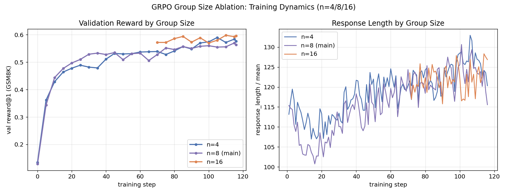
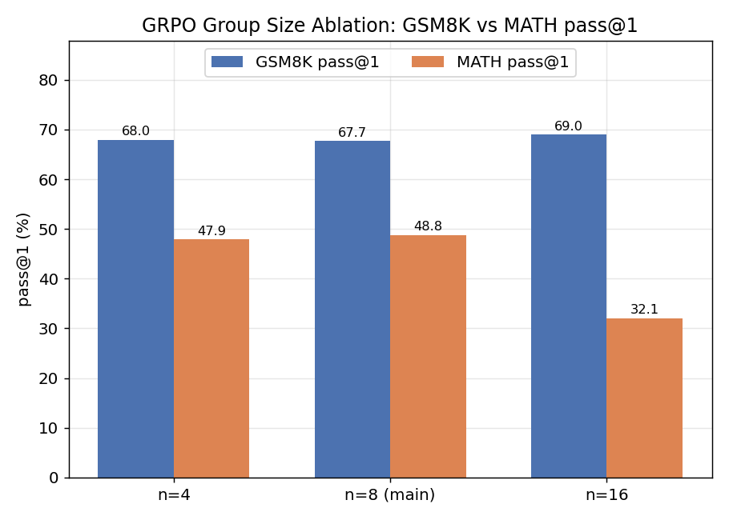

# GRPO Analysis

## Background

GRPO (Group Relative Policy Optimization) is the core RL algorithm behind DeepSeek-Math / DeepSeek-R1: instead of learning a separate value function, it samples a group of outputs per prompt (8 here) and uses the within-group relative ranking of rewards directly as the advantage signal. It was run under the same SFT initialization and rule-based reward as PPO, so the two are directly comparable.

## Setup

Initialized from the 3-epoch SFT cold-start checkpoint, using veRL's `main_ppo` entrypoint with `algorithm.adv_estimator=grpo`, 4-GPU FSDP + vLLM rollout. Key hyperparameters: `train_batch_size=256`, `ppo_mini_batch_size=64`, `rollout.n=8` (group size), `actor_lr=1e-6`, `kl_loss_coef=0.001`, `max_prompt_length=512`, `max_response_length=1024`, 4 epochs (116 steps). Reward: `reward/rule_reward.py` (answer correctness + format).

## Result

| Dataset | pass@1 | pass@4 | pass@8 |
| --- | --- | --- | --- |
| GSM8K | 67.7% | 80.4% | 85.0% |
| MATH | 48.8% | 71.5% | 79.2% |

Validation reward rose monotonically from 0.129 to 0.563 over training, and `response_length` stayed in a narrow 100-125 range throughout — no length blowup, no reward collapse. This is the largest pass@1 gain of any method tested (GSM8K +28.8pp, MATH +19.8pp over SFT-only) and the only RL run in this project that trained without any instability requiring intervention.

Training cost: 4 GPUs, 4 epochs, 116 steps, ~2 hours — between DPO (cheap) and PPO (more expensive due to the critic's extra forward/backward pass).

## Why GRPO Trained Cleanly Here

The most direct comparison is against PPO, which — under matched initialization and reward — collapsed on its first run (see [ppo_analysis.md](ppo_analysis.md)). GRPO's advantage estimate comes from ranking rollouts within the same group, so it never depends on a value function that has to be "warmed up" from a near-random initial state. That specific failure mode (early, noisy advantage estimates from an undertrained critic reinforcing a bad direction) doesn't have an analog in GRPO's update rule.

This is a comparison under one specific setup — small model, sparse rule-based reward, short training run — not a general claim that GRPO is always more stable than PPO. The trade-off GRPO makes is rollout cost: estimating a group baseline requires sampling `n=8` completions per prompt, which is more expensive per training step than PPO's `rollout.n=1`.

## Ablation: Group Size

Same hyperparameters, only `rollout.n` (group size) varied — 4 / 8 / 16, on 2 GPUs.

| Group size | GSM8K pass@1 | GSM8K pass@8 | MATH pass@1 | MATH pass@8 |
| --- | --- | --- | --- | --- |
| 4 | 68.0% | 86.2% | 47.9% | 79.8% |
| 8 (main run) | 67.7% | 85.0% | 48.8% | 79.2% |
| 16 | 69.0% | 84.3% | 32.1% | 59.0% |

`n=4` performs essentially on par with `n=8` (marginally higher on GSM8K), suggesting that on this task, 4 samples are already enough to estimate a useful relative ranking within the group — increasing to 8 doesn't add much. `n=16` continues to improve slightly on GSM8K but drops sharply on MATH (48.8% → 32.1%), while also showing the highest final `val_reward@1` (0.596) of the three settings. That combination — best on the training distribution, worst on the held-out harder task — looks consistent with the larger group size converging more tightly to GSM8K-specific patterns rather than generalizing.

Practically: a smaller group size halves rollout cost with no measurable loss here, so under compute constraints it's the better default. Scaling group size up is not free — it doesn't reliably transfer beyond the task it was tuned on.

(The `n=16` run was also interrupted once mid-training — likely OOM or a session timeout — and resumed from `global_step_70`, so it wasn't a single uninterrupted run like the other two. Noted for completeness; it doesn't change the direction of the result but is a caveat on how clean the comparison is.)

## Summary of Findings

| Question | Observation |
| --- | --- |
| How did GRPO compare to PPO/DPO? | Best result and most stable training of all three RL methods under matched setup |
| Why did it avoid PPO's failure mode? | No learned value function, so no early-training regime where the baseline itself is unreliable — specific to this comparison, not a general law |
| Does a larger group size help? | Not reliably — `n=4` matches `n=8`, and `n=16` trades MATH generalization for a marginal GSM8K gain |
| Cost trade-off vs PPO | Higher rollout cost per step (8x completions per prompt), but no critic to train |

---

Raw logs and evaluation JSON paths: [experiments.md](experiments.md), Experiment ③ and its ablation subsection. Full GRPO vs PPO comparison: [ppo_analysis.md](ppo_analysis.md).
