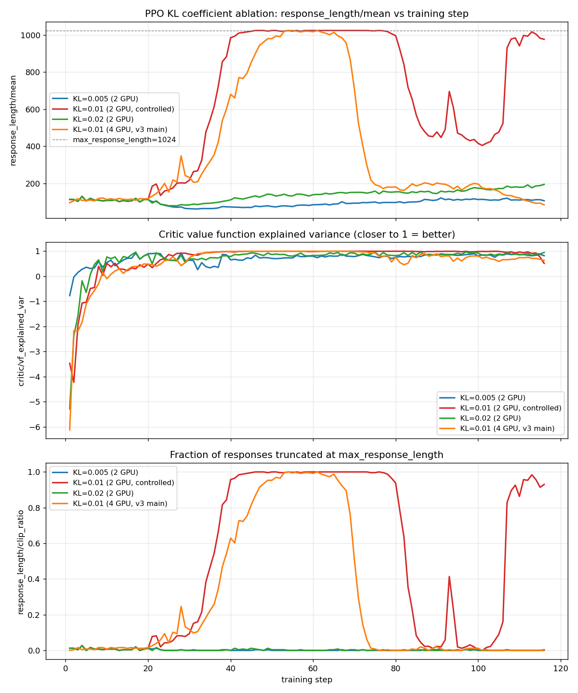

# PPO Stability Analysis: Why Length Collapse Happened and How It Was Fixed

## Background

After cold-start SFT, three RL algorithms were compared under matched initialization and reward: GRPO, PPO, and DPO. Unlike GRPO, PPO introduces an additional learned value model (critic) to estimate advantages via GAE.

The first PPO run — configured with hyperparameters matched to the GRPO run, specifically to isolate the effect of adding a critic — collapsed within the first 20 training steps. The model entered a degenerate mode where every rollout was generated to the maximum token limit:

| step | val reward@1 | response_length/mean | clip_ratio |
| --- | --- | --- | --- |
| 0 | 0.129 | - | - |
| 5 | -0.934 | 183 | - |
| 20 | (no recovery) | 1024 (hard cap) | 100% |

Final evaluation pass@k on this checkpoint was 0%. This document walks through the failure mode, the hypothesized mechanism, the fix, and a follow-up ablation that produced a non-obvious result about KL regularization.

## The Collapse

This was not a gradual degradation — it was a sharp, one-directional shift within a handful of updates. `response_length/mean` went from 183 to 1024 (the `max_response_length` cap, meaning every sample was truncated) in under 20 steps, `clip_ratio` reached 100%, and validation reward dropped from 0.13 to -0.93 and never recovered for the remainder of training.


## Hypothesized Mechanism

We did not directly instrument the advantage values or the critic's internal error at each step, so the explanation below is a hypothesis consistent with the observed metrics (`vf_explained_var`, `clip_ratio`, `response_length`) rather than a directly proven causal chain.

The critic is initialized from scratch and trained jointly with the actor. At the start of training, `vf_explained_var` was -2.27 — worse than predicting the mean — indicating the value function had no meaningful predictive signal yet. GAE advantages computed from an inaccurate value function are largely noise in this regime.

A plausible failure chain:

```
early-stage critic error (near-random value estimates)
        │
        ▼
noisy / miscalibrated advantage estimates
        │
        ▼
a chance update assigns positive advantage to "longer output"
        │
        ▼
policy gradient reinforces the length-increasing direction
        │
        ▼
truncation penalty (flat -1, same order as a wrong answer) too weak to counteract it
        │
        ▼
response length runs away to the hard cap
```

The reward function at the time penalized truncated (no-answer) outputs with a flat -1, the same magnitude as a normal wrong answer. If this hypothesis is correct, that penalty was not steep enough to provide a strong enough corrective signal once the length-increasing direction had been (spuriously) reinforced.

## Why GRPO Did Not Exhibit This Failure Mode

GRPO computes advantages from the relative ranking of rewards within a group of rollouts (8 samples per prompt here) sampled from the same prompt, rather than from a learned value function. This means GRPO's advantage estimates do not depend on a critic that needs to "warm up" — there is no equivalent early-training regime where the baseline itself is unreliable.

We'd stop short of saying "GRPO is stable because it has no critic" as a general law — it's a comparison under one specific setup (small model, sparse rule-based reward, matched hyperparameters). What we can say more precisely: **removing the learned value function removes one specific, identified source of instability that PPO exhibited here** — the compounding effect of early-stage value error feeding into policy updates before the reward signal itself is dense enough to correct it. Whether this generalizes to larger models, denser rewards, or longer critic warmup budgets wasn't tested.

## The Fix

The changes below target the two ends of the hypothesized failure chain: unreliable early advantage estimates, and an under-powered truncation penalty. They fall into three categories.

**1. Stabilize value estimation**

| Parameter | Before | After |
| --- | --- | --- |
| `critic_warmup` | 0 | 20 (critic-only updates before the actor starts updating) |
| `critic_lr` | 1e-5 | 5e-6 |
| `critic.cliprange_value` | 0.5 | 0.2 |

**2. Constrain policy drift**

| Parameter | Before | After |
| --- | --- | --- |
| `kl_loss_coef` | 0.001 | 0.01 |
| `rollout.temperature` | 1.0 | 0.7 |

**3. Reward shaping**

| Parameter | Before | After |
| --- | --- | --- |
| `truncated_extra_penalty` | 0 (disabled) | 2.0 |
| `length_penalty_start_ratio` | - | 0.9 (progressive penalty kicks in at 90% of the token budget, before truncation actually occurs) |

Implementation: the truncation penalty logic lives in `RuleReward.score()` in `reward/rule_reward.py`. `verl/workers/reward_manager/naive.py` was patched to detect via `inspect.signature` whether a custom `compute_score` accepts a `response_length_ratio` argument, and pass it through if so — this keeps the change opt-in and leaves the already-working GRPO path untouched.

**Result after the fix (v3):**

| step | val reward@1 | response_length/mean | clip_ratio | vf_explained_var |
| --- | --- | --- | --- | --- |
| 0 | 0.129 | - | - | - |
| 20 (warmup ends) | ~0.35 | ~200 | ~5% | ~0.55 |
| 28 (length spike peak) | - | ~348 | ~8% | ~0.60 |
| 60 | ~0.36 | ~150 | ~0% | ~0.70 |
| 116 (final) | 0.358 | 85 | 0% | 0.634 |

Notably, a length spike still occurs around step 21-28 (up to 348 tokens) right as the critic warmup ends and the actor starts updating — this looks like the same underlying dynamic as the original collapse. The difference is that this time `clip_ratio` returns to 0 and reward recovers, rather than continuing to escalate. This "spike then self-correct" pattern (green curve above) is the clearest evidence that the fix addressed the underlying mechanism rather than just suppressing the symptom at this particular hyperparameter setting.

Final GSM8K pass@1 reached 42.6% (MATH: 31.2%) — well below GRPO's 67.7%/48.8%, but a qualitative change from the 0% of the collapsed run.

## KL Coefficient Is Not a Monotonic Stability Knob

A natural follow-up question: is `kl_loss_coef=0.01` actually necessary, or was it an arbitrary choice? With everything else from the fix held constant, two additional runs were done at 0.005 and 0.02.

| kl_loss_coef | GPU | GSM8K pass@1 | val reward@1 (final) | Length behavior |
| --- | --- | --- | --- | --- |
| 0.005 | 2 | 61.9% | 0.505 | stable throughout, 60-130 range |
| 0.01 (4 GPU, main run) | 4 | 42.6% | 0.358 | spiked to 1024 at step 21-39, recovered |
| **0.01 (2 GPU, controlled)** | 2 | **2.4%** | **-1.258** | **spiked repeatedly, never fully stabilized** |
| 0.02 | 2 | 62.1% | 0.503 | stable throughout, slow rise to ~190 |

The common assumption is that a larger KL penalty should monotonically improve stability. That's not what happened: 0.005 and 0.02 — a tighter and a looser constraint, respectively — both trained cleanly and outperformed the 0.01 run by a wide margin (61-62% vs 42.6% pass@1). The value in between was the one that was unstable, and this was confirmed with a dedicated 2-GPU controlled run (matching all other hyperparameters) specifically to rule out "this was a coincidence of the 4-GPU run" — the 2-GPU version collapsed more severely and never recovered within the training budget.



One candidate explanation: at this specific configuration, 0.01 happens to sit in a region where the critic's advantage estimate right after warmup and the resulting policy update magnitude reinforce each other, while 0.005 and 0.02 each avoid this particular resonance for different reasons (tighter constraint suppresses the exploratory direction; looser constraint doesn't happen to hit the same update trajectory). Quantitatively, at step 21 the KL loss term's contribution to the total loss is on the order of 0.0002-0.0003 regardless of whether the coefficient is 0.005, 0.01, or 0.02 — small relative to the policy gradient term in all three cases — which suggests the KL coefficient's absolute magnitude in this range isn't what determines the outcome; something about which local update direction the critic happens to push toward at that specific step likely matters more.

This remains a hypothesis. Confirming it would require repeating the `kl_loss_coef=0.01` run with different random seeds to check whether the instability is reproducible across seeds or specific to this one training trajectory — not done here due to time constraints. **Practical takeaway**: at least under this training configuration, 0.01 is not a safe default; 0.005 or 0.02 are both better-supported choices.

## Summary of Findings

| Question | Observation |
| --- | --- |
| Why did PPO collapse? | Hypothesis: early-stage critic error produced noisy advantage estimates, and the truncation penalty wasn't steep enough to counteract a spurious length-increasing update |
| Why was GRPO stable under the same reward/init? | It doesn't rely on a learned value function, removing this specific failure mode — not evidence that PPO is inherently unstable in general |
| Did a larger KL coefficient always help? | No — 0.005 and 0.02 were both stable, but 0.01 collapsed reproducibly across two independent runs (4 GPU and 2 GPU) |
| What fixed the original collapse? | Critic warmup + tighter critic clipping (stabilize value estimation) + KL/temperature (constrain drift) + a progressive truncation penalty (reward shaping) — three complementary interventions, not a single silver bullet |
| Best-supported KL setting here | 0.005 or 0.02, not 0.01 |

---

Raw logs and evaluation JSON paths: [experiments.md](experiments.md), Experiment ④ and its ablation subsections.
